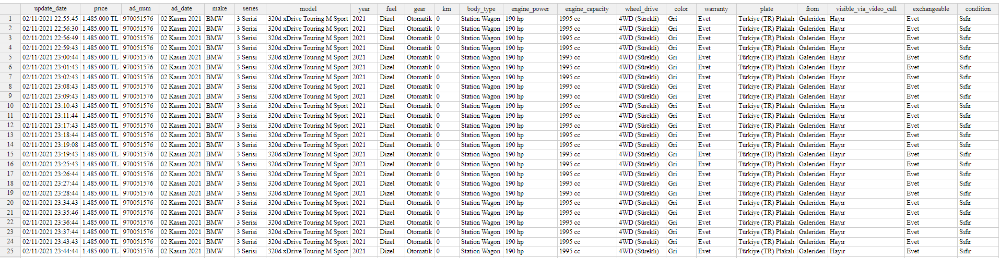

# Sahibinden Tracker

Sahibinden Tracker is a python program for tracking adverts in Sahibinden.com.

## Installation

- Clone this project with ```git clone https://github.com/f4tih35/sahibinden_tracker.git```
- If you want, you can use virtual environments. Checkout [Virtual Environments and Packages](https://docs.python.org/3/tutorial/venv.html)
- Install required packages with ```pip install -r requirements.txt```
- Done!

## Usage

- You can track only one advert from url:
```bash
python run.py -u [url]
```

- Or you can track list of adverts from file:
```bash
python run.py -f [file path]
```
File example (urls.txt):
```txt
https://www.sahibinden.com/ilan/vasita-otomobil-opel-nokta-hatasiz-boyasiz-tramersiz-sahibinden-opel-corsa-959054302/detay
https://www.sahibinden.com/ilan/vasita-otomobil-bmw-sahibinden-temiz-bmw-520i-garaj-arabasi-958330152/detay
https://www.sahibinden.com/ilan/vasita-otomobil-renault-hatasiz-boyasiz-servis-bakimli-lasman-renk-958957566/detay
https://www.sahibinden.com/ilan/vasita-otomobil-alfa-romeo-temiz-ve-bakimli-958354645/detay
https://www.sahibinden.com/ilan/vasita-otomobil-skoda-ilk-sahibinden-hatasiz%2Cboyasiz%2Ctramersiz-67.000-km-958730772/detay
```

- Or you can automate with Cron. Checkout: [How to setup a Cron job?](https://askubuntu.com/a/2369) 

Example Cron job:
> Create script file -> sahibinden_tracker_job.sh
```
#!/bin/sh
python sahibinden_tracker/run.py -f [path of file]
```

> open the cron tasks file with 
```bash 
crontab -e
```
> add the jobs path line
```bash
* * * * * /home/fatih/sahibinden_tracker_job.sh
```
This will be run every minute.

## Result

Data is currently being written to a csv file. You can read with an [online csv viewer](https://limonte.github.io/csv-viewer-online/)



Have fun!
